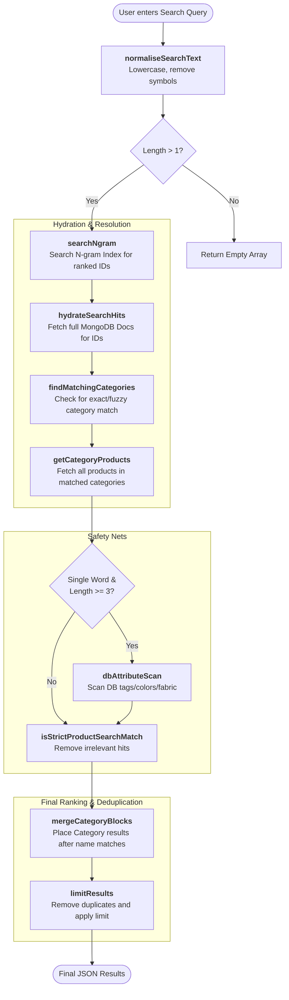

# Search Engine Architecture & Mental Model

This document outlines how the search system works, from a user's query to the final ranked results shown in the UI or test reports.

---

## 1. High-Level Mental Model

The search system is a **Tiered Pipeline**. Instead of just looking for exact matches, it processes the query through multiple "filters" and "safety nets" to ensure that even with typos or partial words, the most relevant results (Categories and Products) appear first.

### Ranking Tiers (Priority Order)
1.  **Tier 1:** Products whose name **starts with** the query.
2.  **Tier 2:** Products whose name **contains** the query.
3.  **Tier 3:** **Categories** whose name matches the query.
4.  **Tier 4:** Products belonging to those matched categories.
5.  **Tier 5:** Products matched by **Tags/Attributes** (Color, Fabric, Occasion, etc.).

---

## 2. Technical Flow Chart



---

## 3. Core Functions Breakdown

| Function | Responsibility | Example |
| :--- | :--- | :--- |
| `normaliseSearchText` | Cleans the query for consistency. | `"Blue-Kurti!"` → `"blue kurti"` |
| `searchNgram` | Uses fragments (n-grams) to find matches even with typos. | `"kurt"` matches `"kurta"`, `"kurti"` |
| `findMatchingCategories` | Resolves queries like "Saree" to the Saree category block. | `"Sarees"` matches Category `"Sarees"` |
| `dbAttributeScan` | Direct database scan for structured fields (fabric, work, etc.). | `"Silk"` matches products with `fabric: "Silk"` |
| `isOrderedSubsequenceMatch` | Handles typos by checking if letters appear in order. | `"krta"` matches `"kurta"` |
| `buildWordVariants` | Handles plural/singular variations. | `"saree"` matches `"sarees"` |

---

## 4. Example: How Results Are Shown

When a user searches for **"kurta"**, the internal result list is built like this:

### Step 1: Raw Hits
The N-gram engine finds 50 products.

### Step 2: Tiered Sorting
1.  **Direct Name Match:** "Navy Blue **Kurta**" (Tier 1)
2.  **Category Match:** It finds the **"Kurta Sets"** Category. (Tier 3)
3.  **Category Products:** It pulls all products inside "Kurta Sets". (Tier 4)
4.  **Attribute Match:** A dress with a tag "kurta style" is found. (Tier 5)

### Step 3: Result Formatting (JSON/MD)
The final list sent to the UI or the Test Report looks like this:

```json
[
  { "type": "product", "data": { "name": "Navy Blue Kurta", "price": 1200 } },
  { "type": "category", "data": { "name": "Kurta Sets" } },
  { "type": "product", "data": { "name": "Blue Printed Shirt", "subCategory": "Kurta Sets" } }
]
```

---

## 5. Maintenance
To keep the search fast, the **N-gram Index** must be rebuilt when large amounts of data are imported. This is handled by:
`await rebuildIndex();` in the server services.
